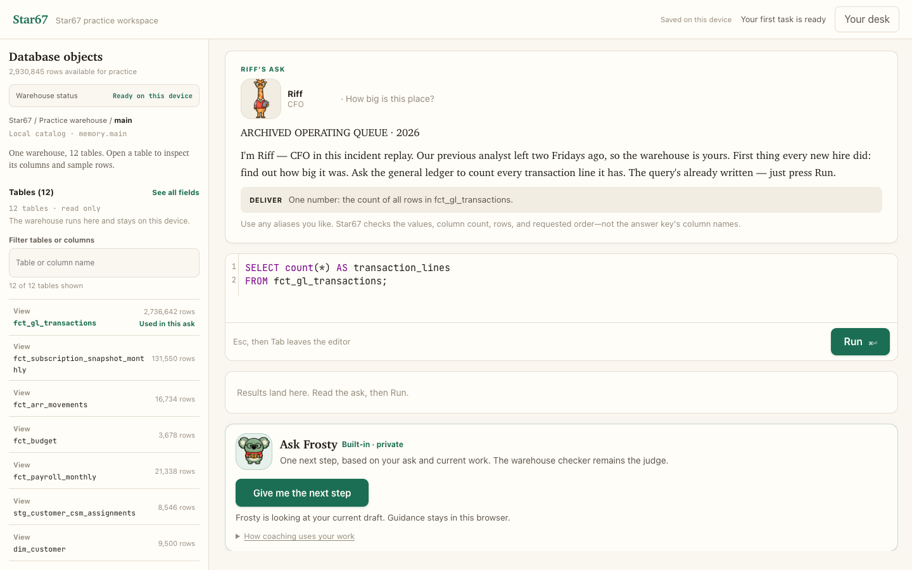

# Star67

**[Launch Star67 in your browser →](https://learn-sql-peach.vercel.app/)**

Star67 is a fictional FP&A desk for learning practical SQL. Pick a business
question, write a query, and get clear feedback from a practice warehouse in
your browser.

No account, upload, API key, paid service, or AI model is required. Your query
and progress stay in your browser.


The question, tables, query editor, and feedback stay together in one view:



## Run it on your computer

The link above is the easiest way to start. For a local copy, install
[Node.js 20+](https://nodejs.org/), clone this repository, and run:

```bash
./start
```
