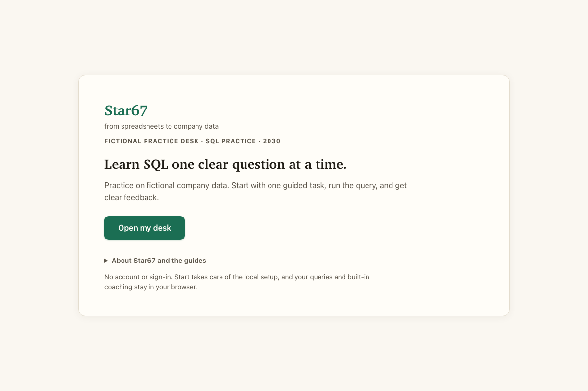
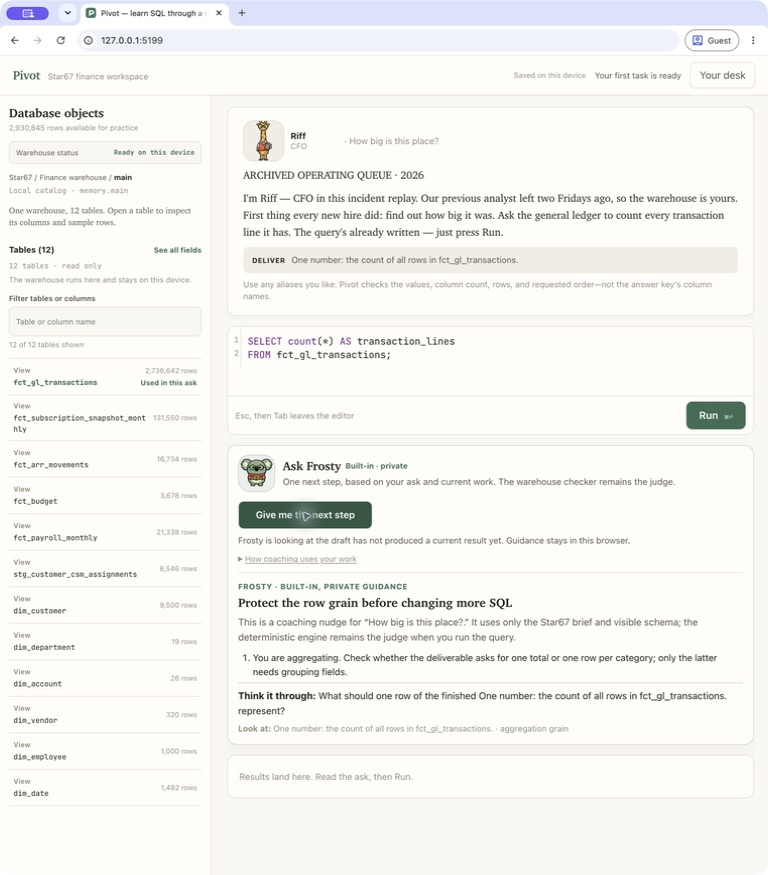

# Star67

## Open the practice desk

**[Launch Star67 in your browser →](https://learn-sql-peach.vercel.app/)**

Star67 is a fictional FP&A desk for learning practical SQL. Pick a guided
business question, write a query, run it against the practice warehouse in your
browser, and get clear feedback.

No account, upload, API key, paid service, or AI model is required. Your query
and progress stay in your browser.



The practice desk keeps the question, tables, query editor, and feedback
together in one view:



## Run it on your computer

The link above is the easiest way to start. For a local copy, install
[Node.js 20+](https://nodejs.org/), clone this repository, and run:

```bash
./start
```

The source is MIT licensed. Bundled artwork has a separate
[asset license](public/characters/desk-crew/ASSET_LICENSE.md); see the
[third-party notices](THIRD_PARTY_NOTICES.md).
