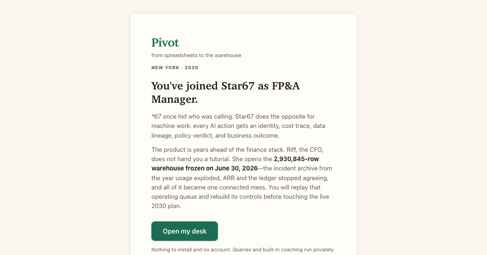

# Pivot

Learn SQL by doing a realistic finance job.

Pivot opens a fictional company's warehouse in your browser and gives you a
first query that already runs. From there, 200+ guided missions build joins,
time-series work, planning analysis, and interview confidence without turning
the experience into a syntax textbook.



The database and your progress stay in your browser. No account is required.

## Welcome to Star67

It is 2030, and companies have more AI agents doing work than people supervising
it. *67 once hid who was calling. Star67 does the opposite for machine work:
every AI action gets an identity, cost trace, data lineage, policy verdict, and
business outcome. It is the system of record for autonomous work.

Its platform subscription pays for governance; metered activity creates the
usage business. That combination also creates a wonderfully difficult finance
company. Product usage, ARR, and recognized revenue disagree. Customer
ownership changes faster than the CRM. Hiring, contractors, and shared
infrastructure all landed in a plan written for a smaller company.

Before you touch the live 2030 plan, CFO Riff opens the warehouse frozen on
June 30, 2026: the incident archive from the year those problems first became
connected. Each mission replays an archived operating request. You are not
collecting syntax badges; you are rebuilding the financial controls the
company still uses.

## Try it

Choose **Open my desk** and run the query waiting for you. The first useful
result arrives before you need to write SQL from scratch.

## Run it locally

You need Node.js 20 or newer.

```bash
npm ci
npm run dev
```

The development command generates the fictional warehouse before starting the
app. Open the local URL Vite prints.

For the full release floor:

```bash
npm test
npm run build
npm run preview
```

`npm test` checks deterministic data, error explanations, formatting, mission
packs, progression, the casebook, navigation, and progress import.
`npm run build` regenerates the warehouse, runs that suite, type-checks, and
creates the production app.

## Privacy

DuckDB runs locally in a web worker. Queries and results remain in the browser.
The open-source release uses deterministic built-in coaching. No coaching
request leaves the browser.

## Project map

- `src/` — React workspace, SQL engine, missions, grading, and progress
- `scripts/generate-data.mjs` — deterministic fictional warehouse generator
- `scripts/*contract.mjs` — release contracts
- `public/data/` — generated local warehouse files, ignored by Git
- `public/duckdb-extensions/` — vendored DuckDB extension files

Mission content is fictional. The public desk crew uses source-defined SVG
avatars; no private or third-party portrait assets are required.

## Contributing

Keep the first win fast, preserve local-first privacy, and prefer a small
visible improvement over a new subsystem. Changes to mission or grading
behavior need a deterministic contract. UI changes need desktop and 320px
browser proof.

## License

MIT. See `LICENSE`.
