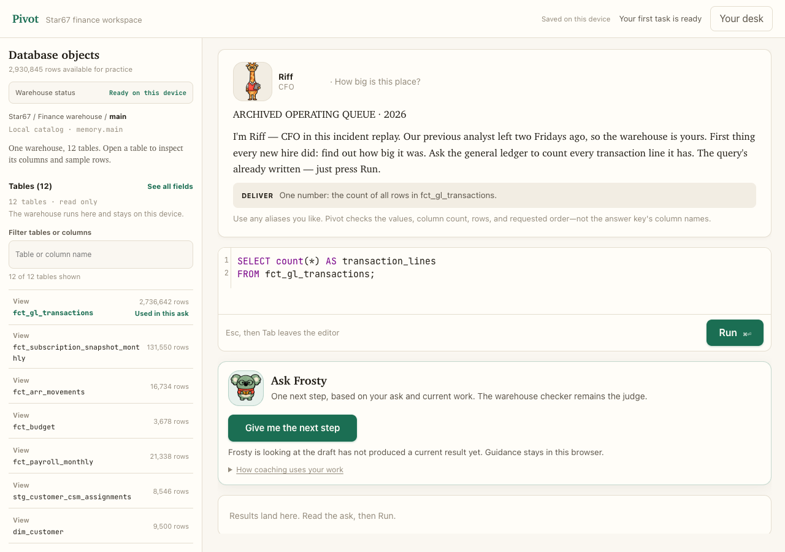
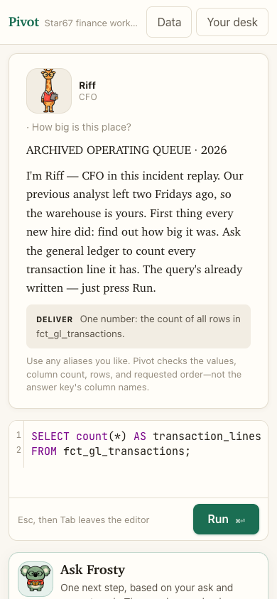

# Star67

[Open Star67 in your browser →](https://learn-sql-peach.vercel.app/)

Learn SQL by solving realistic finance questions inside a fictional company.
Practice at the Star67 finance desk in your browser—no account, uploads, or AI
setup required.

Hi, I’m Nicole. I built Star67 because learning SQL felt much easier when the
question came from a real finance desk instead of a blank editor.


## Start here

Open Star67, choose your first task, and press **Run**. The first query is ready
for you. Use the plain-English hints if you get stuck. Your saved SQL and
progress stay in this browser.

## What you’ll do

- Answer questions about revenue, planning, headcount, customers, and performance.
- Learn practical SQL through guided tasks, reusable queries, and clear feedback.
- Work through 242 guided tasks, optional interview practice, and skill badges.

## The Star67 story

Star67 is a fictional data company in 2030. You join its FP&A team when usage is
growing, revenue no longer reconciles, and hiring has outpaced the plan. Every
company, person, transaction, task, and result is fictional.

Six Animina guides run the desk: Riff brings structure, Rex watches controls,
Coco connects analysis to explanation, Zi focuses on decisions, Fin checks SQL,
and Frosty helps you recover when a query gets stuck.

## Private by design

DuckDB and deterministic coaching run in your browser. There is no account,
personal-data upload, or external AI API. Export your progress if you want to
move it; clearing browser storage resets local progress.

## For contributors

Local setup is only for people changing the project. Requires Node.js 20+:

```bash
npm ci
npm run dev
```

Before opening a pull request, run `npm test` and `npm run build`. The source
code is MIT licensed; the Animina artwork has a separate
[asset license](public/characters/desk-crew/ASSET_LICENSE.md).
You need Node.js 20 or newer. Open the local address shown in Terminal, choose
**Open my desk**, and press **Run** on the query waiting for you.

That is the whole setup. Star67 generates its fictional finance database
automatically.

## Working proof

These are real browser captures of the local Star67 desk using fictional data.
The coaching panel has one action—**Give me the next step**—and keeps its
deterministic, private guidance in the browser. There is no account, paid
provider, or private interview material in these images.





The desktop flow was also opened in a clean Chrome Guest window with Computer
Use; [that local dogfood capture](docs/pivot-computer-desk.png) shows the
warehouse, editor, one coach action, and private built-in response together.

## What you’ll practice

Star67 currently includes:

- 242 guided FP&A tasks
- A deterministic fictional database with 2,930,845 rows
- Projects covering revenue, planning, variance analysis, workforce costs,
  retention, forecasting, and close
- Plain-English error help
- Saved SQL you can reuse
- 37 capability badges backed by checked work
- Five optional interview-practice sets

You do not need to finish hundreds of lessons before accomplishing something
useful. The first query is ready to run, and each task builds naturally from the
work before it.

There are no streaks, arbitrary points, or hidden readiness scores. Your
progress is simply the work you have completed, the SQL you have saved, and the
next skill you are building.

Frosty is intentionally simpler than a menu of “nudge,” “schema,”
“relationships,” “rehearse,” and “review” buttons. Choose one next step; Star67
routes it from the evidence already on screen. The local checker still decides
whether SQL is correct, and Frosty cannot edit SQL or mark work complete.

## Welcome to Star67

Star67 is a fictional data company in 2030.

Companies now have AI agents doing real work across their businesses, but they
still need to know who authorized that work, what it cost, which data it used,
and whether it produced a useful result. Star67 is the system of record for
that activity.

The name is a small reversal of `*67`: instead of hiding who is calling, Star67
makes machine work accountable.

You join the FP&A team during a difficult moment. Usage is growing quickly, ARR
and recognized revenue do not agree, customer ownership keeps changing, and
hiring has outpaced the plan. Before Finance updates the live 2030 forecast, you
replay the company’s archived 2026 database and rebuild the controls the team
needs.

Every company, person, transaction, task, and result in Star67 is fictional. The
practice is designed to feel realistic; it does not reproduce any real
company’s private data or interview process.

## Meet the Animina crew

The crew is the heart of Star67. These six hand-drawn guides began in the
Animina character universe and now run the Star67 finance desk:

- **Riff**, the giraffe CFO, helps with structure and relationships.
- **Rex**, the rhino Controller, watches joins, duplicates, controls, and
  missing values.
- **Coco**, the dog People Partner, helps connect analysis to a clear business
  explanation.
- **Zi**, the penguin CEO, keeps the work focused on decisions and outcomes.
- **Fin**, the shark Data Lead, cares about SQL correctness, data grain, and
  reliable queries.
- **Frosty**, the koala Recovery Coach, offers calm help when a query gets
  stuck.

They are not a second points system or decoration added after the fact. Each
one represents a different kind of judgment that real finance work requires.

Their exact visual identity is protected by a deterministic manifest and
checksum contract. New poses start from an immutable character anchor, so a
new illustration can be surprising without quietly turning Coco into a bird or
Frosty into a teddy bear.

The artwork is copyright First Bite Labs LLC and is included by permission. It
is not covered by Star67’s MIT License; see
[`public/characters/desk-crew/ASSET_LICENSE.md`](public/characters/desk-crew/ASSET_LICENSE.md).

## Private by design

Star67 uses DuckDB inside a browser web worker. Your SQL, query results, saved
work, progress, and built-in coaching interactions stay in your browser. The
public version uses deterministic guidance written into the app, so coaching
does not send a request to an external AI service.

If you clear your browser storage, your local progress may be removed. Star67
includes a progress-code export so you can keep or move your work yourself.

## Build and test it

For the full local release check:

```bash
npm test
npm run build
npm run preview
```

`npm test` checks deterministic data generation, error explanations,
formatting, task packs, navigation, badge progression, progress import, and the
six immutable crew identities.

For browser-level testing against the preview app:

```bash
npm run smoke
npm run crew:proof
```

To compose a deterministic image-edit prompt for a new crew pose:

```bash
npm run crew:prompt -- frosty "Helping a learner recover from a broken join"
```

The prompt always names the base reference and identity locks. It also carries
my single-illustrator rule: a worksheet, chart, laptop, or mug must use the same
line weight, pencil tooth, broken fill, palette, and detail level as the animal
beside it. A beautiful character with a thin vector-style prop is still a
failed illustration. Generated variants stay outside `public/` until a human
visual review passes.

Add `--write` to save a prompt receipt with the base hash, prompt hash, variant
slug, material-cohesion policy, and intended output. Before reviewing a
generated PNG, verify that it is traceable, uses real binary transparency with
no hidden halo colors, and differs from the base in actual decoded pixels—not
just in file metadata:

```bash
npm run crew:verify -- output/crew-studio/example.png output/crew-studio/example.prompt.json
```

## Project map

- `src/` — the React app, SQL workspace, task grading, progress, and Star67 crew
- `scripts/generate-data.mjs` — deterministic fictional finance-data generator
- `scripts/*contract.mjs` — behavioral and release contracts
- `public/data/` — generated local warehouse files
- `public/characters/desk-crew/` — licensed art, provenance, and identity
  manifest
- `public/duckdb-extensions/` — local DuckDB extension files

## Contributing

I want Star67 to remain welcoming to someone who knows spreadsheets but may
never have opened a code editor before.

A good contribution should make the first useful result faster, the finance
work more realistic, or the explanation clearer. Please keep the experience
local-first and avoid adding a new system when a smaller visible improvement
will do.

Changes to task content, grading, or character identity need a deterministic
contract. User-interface changes should be checked in a real browser at
desktop and narrow mobile widths.

## License

Star67’s source code is MIT licensed. See `LICENSE`.

The Animina character and world artwork has a separate, more restrictive
license. See
[`public/characters/desk-crew/ASSET_LICENSE.md`](public/characters/desk-crew/ASSET_LICENSE.md).
